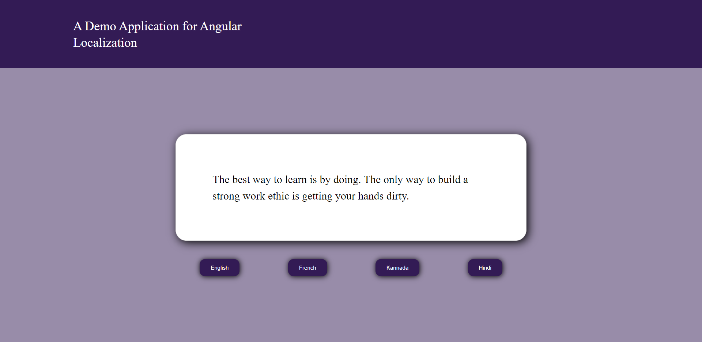

# Angular-Internationalization



## Development server

`git clone https://github.com/Manoranjan-D/Angular-Internationalization.git`

`cd Angular-Internationalization && npm i`

`npm start`

Navigate to `http://localhost:4200/`. The app will automatically reload if you change any of the source files.

## Run by Docker Image

`docker pull manoranjandocker/angular-internationalization`

`docker run`

### Steps for making Angular application localization

1. Create angular project
   `ng new project-name`

2. Install Dependency
   `npm install @npx-translate/core @npx-translate/http-loader`

3. Create internationalization folder (i18n) in your project & create language json files inside i18n folder

4. Export a function in app module

```typescript
export function createTranslateLoader(http: HttpClient) {
  return new TranslateHttpLoader(http, "./assets/i18n/", ".json");
}
```

5. Initiate the translate module and set the default language

```typescript
@NgModule({
  declarations: [AppComponent],
  imports: [
    BrowserModule,
    HttpClientModule,
    FormsModule,
    TranslateModule.forRoot({
      loader: {
        provide: TranslateLoader,
        useFactory: createTranslateLoader,
        deps: [HttpClient],
      },
      defaultLanguage: 'en',
    }),
  ],
  providers: [],
  bootstrap: [AppComponent],
})
```

6. Create service to change the language

```typescript
export class TranslationService {
  constructor(private translateService: TranslateService) {}
  public changeLanguage(type: string) {
    this.translateService.use(type);
  }
}
```

7. Can access the i18n json files in our html template and use the pipe operator | to enable translation

```html
<p>{{ "Demo-app.title" | translate }}</p>
```

8. By injecting the translate service in .ts file, can change the language based on the used action

```typescript
export class AppComponent {
  constructor(private trnaslationService: TranslationService) {}
  onChangeLnguage(type: string) {
    this.trnaslationService.changeLanguage(type);
  }
}
```
